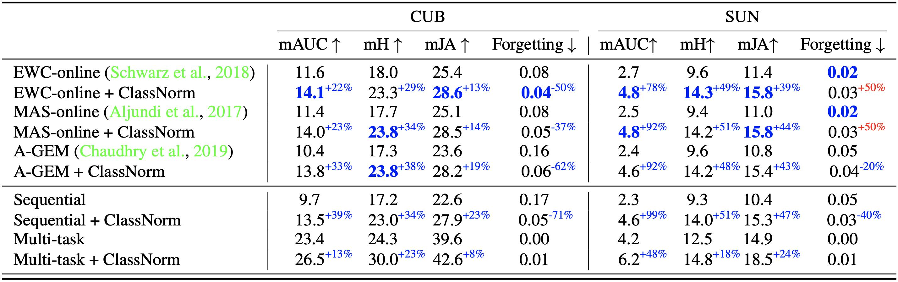

# About

This repo contains the code for the [Class Normalization for Continual Zero-Shot Learning paper](https://arxiv.org/abs/2006.11328) from ICLR 2021:
- the code to reproduce ZSL and CZSL results
- the proposed CZSL metrics (located in `src/utils/metrics.py`)
- fast python implementation of the AUSUC metric

In this project, we explored different normalization strategies used in ZSL and proposed a new one (class normalization) that is suited for deep attribute embedders.
This allowed us to outperform the existing ZSL model with a simple 3-layer MLP trained just in 30 seconds.
Also, we extended ZSL ideas into a more generalized setting: Continual Zero-Shot Learning, proposed a set of metrics for it and tested several baselines.

<div style="text-align:center">

</div>

# Installation & training
### Data preparation
For ZSL, we tested our method on the standard GBU datasets which you can download from [the original website](https://www.mpi-inf.mpg.de/departments/computer-vision-and-machine-learning/research/zero-shot-learning/zero-shot-learning-the-good-the-bad-and-the-ugly).
For CZSL, we tested our method on SUN and CUB datasets.
In contrast to ZSL, in CZSL we used raw images as inputs instead of an ImageNet-pretrained model's features.

### Installing the `firelab` dependency
You will need to install [firelab library](https://github.com/universome/firelab) to run the training:
```
pip install firelab
```

### How to run ZSL training
Please, refer to this [Google Colab](https://colab.research.google.com/drive/125-hNotS79DH-6lb3CNcN3PaDZfPxasV?usp=sharing): it contains the code to reproduce our results.

## How to run CZSL training
To run CZSL training you will need to run the command:
```
python src/run.py -c attrs_head -d MY_DATASET
```
Where `MY_DATASET` is a dataset from the list: ["sun", "cub"].

# Results
## Zero-shot learning results
<div style="text-align:center">

</div>

## Continual Zero-Shot Learning results
<div style="text-align:center">

</div>


## Training speed results for ZSL
<div style="text-align:center">

</div>
